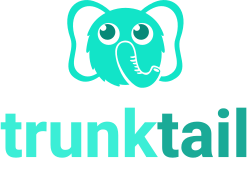
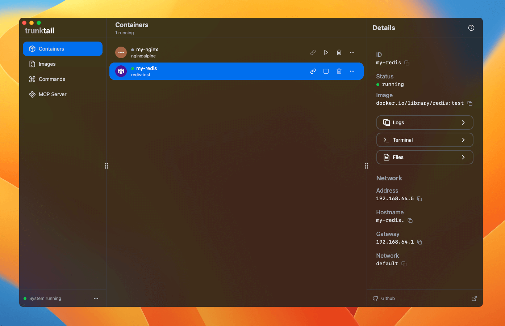

# Trunktail

**A modern UI for [Apple Container](https://github.com/apple/container)**, providing an intuitive desktop experience for managing containers and images.



**Why Apple Container?**

Compared to Docker, Apple Container delivers significantly better performance and lower resource usage on macOS, making it the preferred choice for native container workflows on Apple devices.

Trunktail brings the power of Apple Container to a user-friendly interface, with advanced features for developers and automation workflows.

## Download

Get the latest release from the [Releases Page](https://github.com/elliothux/trunktail/releases).

## Additional tools in this repository:

- **CLI document** ([View Docs](https://trunktail.pages.dev)) — Auto-generated, always up-to-date CLI and API documentation.
- **MCP Server** ([MCP Server README](./packages/mcp-server/README.md)) — Model Context Protocol server for LLM and automation integration.

## Project Structure

```
apps/
  trunktail/   # Desktop client
  docs/        # Documentation site
packages/
  commands/    # CLI commands metadata
  mcp-server/  # MCP Server
```

## Quick Start

### Prerequisites

- Node.js 18+ or Bun 1.0+
- macOS (Apple Container CLI required)

### Install dependencies

```bash
bun install
```

### Launch Desktop App

```bash
bun run dev:tauri
```

## Tech Stack

- **Frontend**: React 19, TanStack Router, HeroUI, Tailwind CSS, Vite
- **Desktop**: Tauri, Rust, Swift (Native Bridge)
- **CLI/Server**: TypeScript, Node.js/Bun, MCP Protocol
- **Docs**: Astro Starlight

## License

This project is licensed under the MIT License. See [LICENSE](./LICENSE) for details.

## Contact

- **GitHub**: [@elliothux](https://github.com/elliothux)
- **X (Twitter)**: [@elliothux](https://x.com/elliothux)

